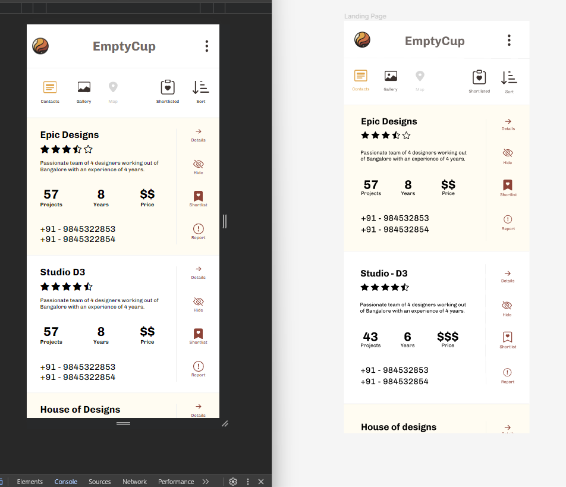

## In line with my assignment, I've ensured that the UI is responsive. 

## To mimic a mobile interface use the screen size settings in inspect menu.

## Deployement 

Server  (AWS)  : https://jjk6hz2kxi.execute-api.us-west-2.amazonaws.com/listings

<hr>


These instructions will get you a copy of the project up and running on your local machine for development and testing purposes.

### Prerequisites

What things you need to install the software:

- [Docker](https://www.docker.com/get-started)
- [Docker Compose](https://docs.docker.com/compose/install/) (Included with Docker Desktop on Windows and Mac)

### Installing

A step-by-step series of examples that tell you how to get a development environment running.

1. **Clone the Repository**

    ```
    git clone 
    cd EmptyCup-assignment
    ```

2. **Build and Run with Docker Compose**

    This command will build the Docker images for both the frontend and backend services and start the containers.

    ```
    docker-compose up --build
    ```

    To run the containers in the background, add the `-d` flag:

    ```
    docker-compose up --build -d
    ```

3. **Accessing the Application**

    - The Flask application will be accessible at `http://localhost:5000`.
    - In order to get all listings `http://localhost:5000/listings`.
    - The frontend application will be accessible at `http://localhost/index3.html`.
    -  `index.html` contains only UI
    - `index2.html` contains backend in Flask
    - `index3.html` contins backend along with MongoDB database 

4. **Stopping the Containers**

to stop the containers, run:
```
docker-compose down
```

<hr/>


# DEMO Iterative 


## 1.  Responsive Replica of  single mobile web page. 📲
### Compared to figma 
### Only UI is in : 


## 2.   Shortlist Functionality ⚙️
###Video Demo : wait few seconds to load video


## 3.  Server 🖥️

### 3.1 .  Flask Server  at port 5000  + feaching in frontend + ShortlistFunctionality 
#### Flask Server Demo : wait few seconds to load video

 
### 3.2 .  MongodDb database + Flask Server  at port 5000  + feaching in frontend + ShortlistFunctionality 
#### Fetching from DB: wait few seconds to load video or please check recording 4
#### Demo showcasing data on cloud also altering database data changes the frontend 


## 4. Deployment 🌐

4.1 Docker Deplyed Demo


4.2 Deployed on AWS 

listings-endpoint : https://jjk6hz2kxi.execute-api.us-west-2.amazonaws.com/listings

4.3 Linked github with AWS using zeet so that whenever code changes in Github, it automatically deploys the latest code. 


## Contact me 

📧 :  singhvidhi1583@gmail.com
